# Il Gioco Dell'Orso
Repository per varie versioni del gioco da tavolo dell'Orso (e del Cacciatore) per promuovere questo antico gioco giocato nelle Alpi italiane e da utilizzare come esercizio di Python

Il Gioco dell'Orso (e del Cacciatore) è un antico gioco da tavolo che si gioca in Valle del Cervo, nelle Alpi italiane

Maggiori informazioni sulla scoperta qui:
https://vallecervobiella.wordpress.com/il-gioco-dellorso/
 (in italiano)

## Regole del Gioco

* Il primo giocatore è il Cacciatore, possiede tre pedine nel tabellone con l'obiettivo di catturare (bloccare) l'orso in una delle dodici posizioni finali
* Il secondo giocatore è l'Orso, possiede un pedone unico; deve muoversi nel tabellone per 40 mosse senza essere bloccato in una delle posizioni finali, per poter fuggire e vincere

### Tavolo da gioco

* La tavola è un cerchio con un cerchio interno e quattro semicerchi, uno per ogni quarto, tutti divisi da due linee perpendicolari.
* Ogni intersezione è una posizione per i giocatori

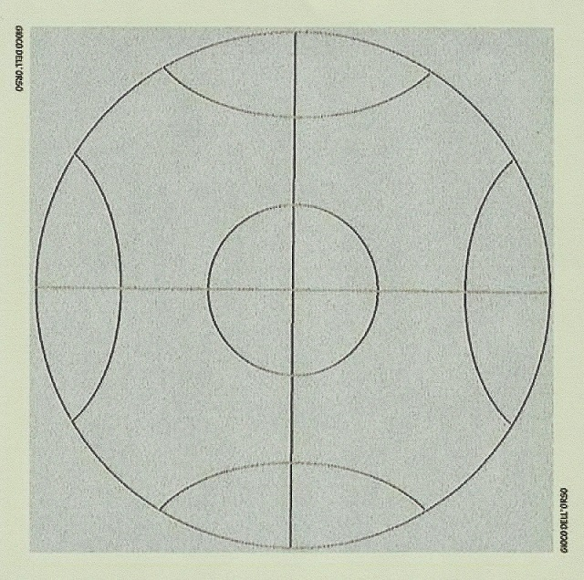

### Posizione iniziale

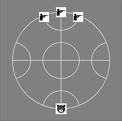

### Posizione finale

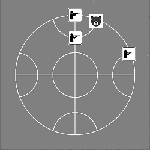 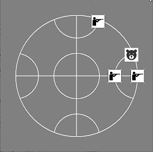 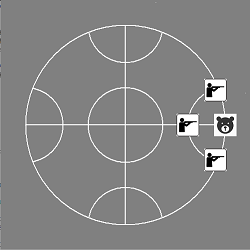

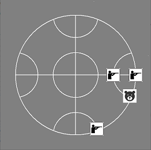 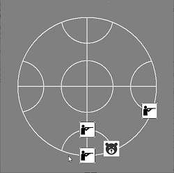 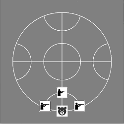

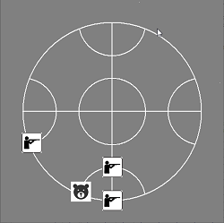 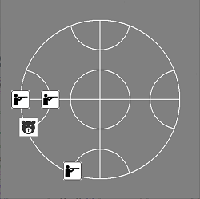 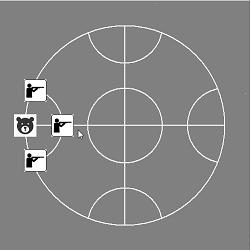

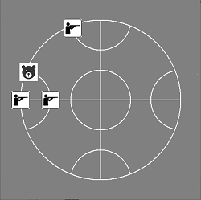 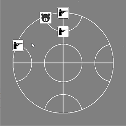 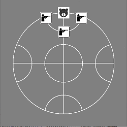

## Aspetti progettuali ##

* Language: Python

### Design Steps

* Procedural _- DONE_
* OO _- DONE_

### UI Steps ###

* Text _- DONE_
* Graphical with Tkinter _- DONE_

### Game Steps ###

* Human vs Human _- DONE_
* Human vs Bot (AI)

